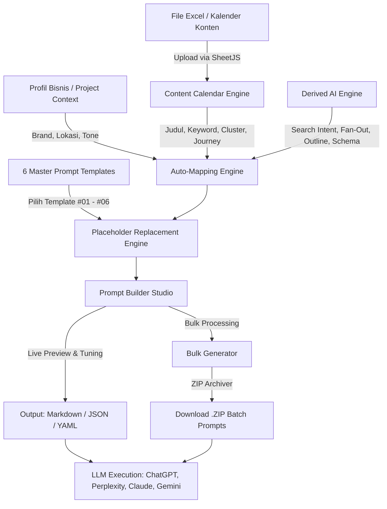

# SEO Prompt Studio — SEO Content & Prompt Operating System

> **Sistem Operasi Kalender Konten & Generator Master Prompt SEO, AEO, dan GEO Otomatis Berstandar Industri.**

SEO Prompt Studio adalah aplikasi web *local-first* yang mengotomatisasi konversi tabel **Kalender Konten SEO 30 Hari** (dari file Excel / Spreadsheet) menjadi prompt penulisan artikel siap pakai berkualitas tinggi. Aplikasi ini memanfaatkan **6 Master Prompt Templates Terpadu** yang mengintegrasikan prinsip Google E-E-A-T, Answer Engine Optimization (AEO - Perplexity/ChatGPT), dan Generative Engine Optimization (GEO - AI Overviews/Claude).

---

## Daftar Isi

1. [Fitur Unggulan](#fitur-unggulan)
2. [Arsitektur & Alur Kerja Sistem](#arsitektur--alur-kerja-sistem)
3. [Katalog 6 Master Prompt Templates](#katalog-6-master-prompt-templates)
4. [Panduan Penggunaan Langkah demi Langkah](#panduan-penggunaan-langkah-demi-langkah)
5. [Spesifikasi Format File Excel](#spesifikasi-format-file-excel)
6. [Struktur Folder Proyek](#struktur-folder-proyek)
7. [Instalasi & Menjalankan Aplikasi](#instalasi--menjalankan-aplikasi)
8. [Konfigurasi Cloud (Supabase)](#konfigurasi-cloud-supabase)

---

## Fitur Unggulan

- **SheetJS Excel Multi-Sheet Importer**: Membaca otomatis file `.xlsx` atau `.csv`, mendeteksi kolom kalender konten dengan toleransi penamaan (*fuzzy matching*), validasi baris instan, dan penyimpanan otomatis ke sistem.
- **6 Master Prompt Templates Terpadu**: Menggabungkan teknik-teknik terbaik dari 40 framework lama ke dalam 6 template komprehensif tanpa template *filler*.
- **Auto-Mapping Placeholder Engine**: Variabel template `{{variable}}` terisi otomatis tanpa ketik ulang, menggabungkan data spesifik artikel (Excel), profil bisnis default (Project), dan analisis logis otomatis (Derived Heuristics).
- **AI Derived Heuristics Engine**: Secara otomatis menganalisis Search Intent, merumuskan minimal 5 pertanyaan semantik (*Query Fan-Out*), membuat kerangka outline H1-H3 modular, dan merekomendasikan Schema.org markup yang relevan.
- **Live Markdown Preview & Immutable Guard**: Menampilkan pratinjau teks artikel secara real-time dengan penghitung kata (*word count*) dan estimasi token AI. Menjamin integritas instruksi prompt tetap 100% utuh.
- **Formatter Multi-Format**: Konversi hasil prompt ke format Markdown (.md), JSON berstruktur, YAML, atau Raw Text.
- **Bulk Generator & Batch ZIP Exporter**: Memilih puluhan artikel sekaligus dari kalender dan mengekspor seluruh prompt ke dalam satu berkas `.zip` dalam hitungan detik.
- **Local-First + Cloud Sync Architecture**: Aplikasi langsung dapat digunakan tanpa login (100% tersimpan di `localStorage` browser), dengan opsi sinkronisasi opsional ke Supabase Cloud Database.

---

## Arsitektur & Alur Kerja Sistem

Alur kerja SEO Prompt Studio menghubungkan data perencanaan editorial hingga prompt siap eksekusi di LLM:



### Penjelasan Tahapan Pipeline:

1. **Tahap 1 — Ingestion & Kalender (Excel Parser)**
   Pengguna mengunggah kalender konten bulanan dalam format Excel (.xlsx). Engine membaca baris artikel, mengekstrak cluster konten, funnel stage (TOFU/MOFU/BOFU), search volume, slug, dan target keyword.
2. **Tahap 2 — Pemilihan Master Template**
   Pengguna memilih salah satu dari 6 Master Templates yang paling relevan dengan tujuan konten (Pillar Otoritas, Perbandingan Produk, Tutorial How-To, Refresh Konten Lama, SEO Lokal, atau BOFU Sales).
3. **Tahap 3 — Auto-Mapping & Heuristic Enrichment**
   Engine secara otomatis mengisi seluruh parameter di dalam template:
   - **Sumber Excel**: Judul artikel, keyword utama, LSI, format konten, slug, CTA.
   - **Sumber Project**: Nama brand bisnis, lokasi target, bahasa, tone of voice.
   - **Sumber Derived (AI)**: Search intent, pertanyaan fan-out, outline H1-H3, entitas semantik, rekomendasi schema JSON-LD.
4. **Tahap 4 — Live Review & Formatter**
   Pengguna dapat meninjau form, melakukan kustomisasi parameter jika diperlukan, serta melihat pratinjau live markdown dan estimasi konsumsi token.
5. **Tahap 5 — Ekspor Tunggal atau Massal (Bulk ZIP)**
   Prompt dapat disalin dengan 1 klik, diunduh sebagai file `.md`, atau diproses secara massal melalui Bulk Generator untuk mengunduh puluhan file prompt sekaligus dalam format `.zip`.

---

## Katalog 6 Master Prompt Templates

Ke-6 template ini dirancang untuk mencakup seluruh kebutuhan strategi konten SEO modern:

| No | ID | Nama Template | Kategori | Fokus & Keunggulan Utama |
|---|---|---|---|---|
| **01** | `tpl-01` | **Master SEO/AEO/GEO Ultimate Pillar & Semantic Authority** | `SEO` | **All-in-one Master Template** untuk artikel pilar (Ultimate Guide). Memadukan *Direct Answer Snippet* (100 kata pertama), Topic Cluster Pillar-to-Spoke, entitas semantic triples (Subjek-Predikat-Objek), Query Fan-Out 6 variasi, dan rekomendasi Schema.org (Article + FAQPage). |
| **02** | `tpl-02` | **Commercial Comparison, Best Round-Up & Buyer's Decision Engine** | `E-Commerce` | Panduan pembelian komparatif (VS Guide, Best List Round-Up). Dilengkapi tabel *Quick Verdict Decision*, parameter evaluasi teknis, itemized pros/cons, panduan skenario "Kapan memilih A vs B", dan *Objection Buster*. |
| **03** | `tpl-03` | **Actionable Step-by-Step How-To & Problem-Solving Tutorial** | `SEO` | Tutorial praktis terstruktur yang dioptimasi untuk Google HowTo Rich Snippets. Memiliki ringkasan tingkat kesulitan, daftar alat & persiapan (*prerequisites checklist*), langkah berurutan aktif (H3 bernomor), dan panduan *troubleshooting* anti-gagal. |
| **04** | `tpl-04` | **SEO Content Refresh, Decay Revival & SERP Intent Realignment** | `SEO` | Re-optimasi artikel lama yang mengalami penurunan peringkat di SERP. Mengidentifikasi celah topik (*content gaps*), memperbarui hook & statistik tahun terkini, menyamakan format dengan tren halaman 1 Google, dan merebut kembali Featured Snippet. |
| **05** | `tpl-05` | **Hyper-Local SEO & Geo-Targeted Commercial Landing Content** | `Local SEO` | Konten halaman wilayah/kota spesifik. Memperkuat sinyal relevansi geografis (Local GEO), mengintegrasikan nama landmark dan kecamatan secara natural tanpa keyword stuffing, menyertakan jangkauan logistik lokal, dan tombol kontak instan via WhatsApp. |
| **06** | `tpl-06` | **BOFU High-Conversion Solution, Sales Closer & Lead Magnet** | `SEO` | Artikel persuasif *Bottom-of-Funnel* berteknik direct-response copywriting. Menyorot kerugian menunda solusi (*cost of inaction*), menyajikan perbandingan paket penawaran harga transparan, jaminan garansi (*risk reversal*), dan alur order tanpa friksi. |

---

## Panduan Penggunaan Langkah demi Langkah

### 1. Membuat & Mengatur Profil Proyek
1. Buka menu navigasi atas lalu pilih atau buat **Project Baru**.
2. Masukkan identitas brand Anda (Nama Perusahaan, Industri, Lokasi Utama, Tone of Voice standar, dan Target CTA default).
3. Informasi ini akan menjadi basis auto-fill pada seluruh prompt yang dihasilkan.

### 2. Mengimpor Kalender Konten Excel
1. Masuk ke halaman **Content Calendar** (`/calendar`).
2. Klik tombol **Import Excel**.
3. Pilih berkas `.xlsx` atau `.csv` kalender konten Anda (tersedia tombol unduh template sampel jika belum memiliki file).
4. SheetJS akan memvalidasi kolom dan memasukkan seluruh artikel ke database kalender dalam hitungan detik.

### 3. Menyusun Prompt di Prompt Builder Studio
1. Masuk ke halaman **Prompt Builder** (`/prompt-builder`).
2. Pilih artikel dari kalender pada dropdown atas.
3. Pilih salah satu dari **6 Master Templates** di panel sebelah kiri.
4. Periksa form parameter: seluruh input penting telah terisi secara otomatis (*Auto-Mapped*). Anda dapat menyesuaikan atau menambahkan catatan manual jika diperlukan.
5. Panel kanan akan langsung menampilkan hasil render Markdown prompt yang siap disalin (*Copy Prompt*) atau diunduh (*Download .md*).

### 4. Ekspor Massal dengan Bulk Generator
1. Masuk ke halaman **Bulk Generator** (`/bulk`).
2. Pilih Master Template yang ingin digunakan (misal: Template 01 untuk artikel pilar).
3. Centang artikel yang ingin diproses (atau gunakan tombol *Pilih Semua*).
4. Klik **Generate Prompts**.
5. Setelah proses selesai, klik **Download All (.ZIP)** untuk mendapatkan seluruh file prompt dalam arsip terkompresi.

### 5. Menjalankan Prompt di AI LLM
Salin prompt yang dihasilkan ke AI pilihan Anda:
- **ChatGPT (GPT-4o / Search)**: Sangat optimal untuk struktur komprehensif dan copywriting persuasif.
- **Perplexity / Claude 3.5 Sonnet**: Sangat optimal untuk riset berbasis fakta, kepatuhan teknis, dan sitasi GEO.
- **Google Gemini 1.5 Pro**: Sangat optimal untuk artikel panjang (*long-form*) dan pengayaan topik pilar.

---

## Spesifikasi Format File Excel

Aplikasi mengenali kolom secara cerdas (*fuzzy column matching*). Kolom-kolom berikut didukung secara otomatis:

| Kolom Rekomendasi | Alias Header yang Dikenali | Deskripsi |
|---|---|---|
| **Day** | `Hari`, `Day`, `Tanggal`, `No` | Penanda slot hari editorial (mis. "Hari 01") |
| **Time Slot** | `Time`, `Jam`, `Slot`, `Waktu` | Jadwal publikasi (mis. "09:00", "13:00") |
| **Cluster** | `Kategori`, `Category`, `Topic`, `Topik` | Klaster topik artikel (mis. "Kursi Ergonomis") |
| **Title** | `Judul`, `Article Title`, `Post Title` | Judul rencana artikel |
| **Primary Keyword** | `Keyword`, `Target Keyword`, `Kata Kunci` | Target keyword utama artikel |
| **Supporting Keywords**| `LSI`, `Secondary Keyword`, `Keyword Tambahan` | Variasi keyword semantik / LSI |
| **Search Volume** | `SV`, `Volume`, `Pencarian` | Estimasi volume pencarian (mis. "> 5.000") |
| **Competition** | `Kompetisi`, `Difficulty`, `KD` | Tingkat persaingan (Rendah / Menengah / Tinggi) |
| **Journey Stage** | `Stage`, `Funnel`, `Tipe Intent` | Tahapan funnel: `TOFU`, `MOFU`, atau `BOFU` |
| **Content Format** | `Format`, `Tipe Konten`, `Jenis Konten`| Tipe artikel (Pillar Guide, VS Guide, dll.) |
| **CTA** | `Call to Action`, `Target CTA`, `Konversi` | Ajakan aksi spesifik (WhatsApp, Katalog, dll.) |
| **Slug** | `URL`, `Permalink`, `Link` | URL slug artikel (mis. "/blog/rekomendasi-kursi") |

---

## Struktur Folder Proyek

```
seomaroon.v2/
├── public/                     # Aset statis & favicon
├── src/
│   ├── components/             # Komponen UI React
│   │   ├── builder/            # Studio Prompt Builder & Markdown live preview
│   │   ├── bulk/               # Bulk Generator & ZIP Exporter
│   │   ├── calendar/           # Content Calendar viewer & Excel importer
│   │   ├── dashboard/          # Ringkasan analitik kalender & metrik proyek
│   │   ├── formatter/          # Konverter multi-format (JSON, YAML, TXT)
│   │   ├── landing/            # Landing page hero, navbar, & visualizer
│   │   ├── layout/             # AppNavbar & project selector
│   │   ├── projects/           # Project manager modal & CRUD
│   │   └── templates/          # Template Library View & custom template creator
│   ├── layouts/
│   │   └── BaseLayout.astro    # Layout induk Astro (Head, meta SEO, theme provider)
│   ├── lib/
│   │   ├── auth/               # Integrasi Supabase Auth & cloud client
│   │   ├── excel/              # Parser SheetJS untuk import kalender
│   │   ├── prompt-engine/      # Library 6 Master Template, parser placeholder, & derived AI
│   │   │   ├── derived-engine.ts       # Generator Intent, Fan-Out, Outline, & Schema
│   │   │   ├── placeholder-engine.ts   # Regex parser & auto-mapping logic
│   │   │   ├── renderer.ts             # Template markdown interpolation
│   │   │   └── template-library.ts     # Definisi 6 Master Prompt Templates
│   │   ├── storage/            # Local-first store, state manager, & mock data
│   │   └── utils/              # Helper download file & formatters
│   ├── pages/                  # Halaman aplikasi & rute Astro
│   │   ├── index.astro         # Halaman Beranda / Landing Page
│   │   ├── calendar.astro      # Halaman Manajemen Kalender Konten
│   │   ├── prompt-builder.astro# Halaman Studio Prompt Builder
│   │   ├── templates.astro     # Halaman Katalog 6 Master Templates
│   │   ├── bulk.astro          # Halaman Ekspor Massal (Bulk Generator)
│   │   ├── dashboard.astro     # Halaman Pusat Metrik & Proyek
│   │   ├── formatter.astro     # Halaman Konverter Format
│   │   └── sitemap.xml.ts      # Generator XML Sitemap otomatis
│   └── types/                  # Definisi TypeScript untuk seluruh model data
├── astro.config.mjs            # Konfigurasi Astro (React + Tailwind integration)
├── tailwind.config.mjs         # Konfigurasi Tailwind CSS (Color palette & typography)
└── package.json                # Dependencies dan script npm
```

---

## Instalasi & Menjalankan Aplikasi

### Kebutuhan Sistem:
- **Node.js**: Versi 18.17.0 atau lebih baru
- **Package Manager**: npm, pnpm, atau yarn

### Langkah Instalasi:

1. **Clone repositori dan masuk ke direktori:**
   ```bash
   git clone <repository-url>
   cd seomaroon.v2
   ```

2. **Install seluruh dependensi:**
   ```bash
   npm install
   ```

3. **Jalankan server development lokal:**
   ```bash
   npm run dev
   ```
   Buka browser pada alamat yang tertera di terminal (default: `http://localhost:4321` atau `http://localhost:4322`).

4. **Build untuk produksi:**
   ```bash
   npm run build
   ```
   Hasil build statis akan disimpan di folder `dist/` dan siap di-deploy ke Vercel, Netlify, Cloudflare Pages, atau server statis lainnya.

---

## Konfigurasi Cloud (Supabase)

Aplikasi dirancang **Local-First**, artinya dapat berfungsi penuh secara *offline* atau tanpa backend database. Jika Anda ingin menyinkronkan data antar perangkat atau kolaborasi tim melalui Supabase:

1. Buat proyek baru di [Supabase](https://supabase.com).
2. Buat file `.env` di root direktori dengan menyalin dari `.env.example`:
   ```env
   PUBLIC_SUPABASE_URL=https://your-project.supabase.co
   PUBLIC_SUPABASE_ANON_KEY=your-anon-key-here
   ```
3. Di dalam aplikasi, klik tombol **Sync Cloud** pada panel navigasi atau halaman Template Manager untuk melakukan sinkronisasi database dua arah.

---

## Lisensi & Kontribusi

Dikembangkan khusus untuk mendukung produktivitas praktisi SEO, content strategist, dan agensi digital dalam memproduksi konten bernilai tinggi secara konsisten.
